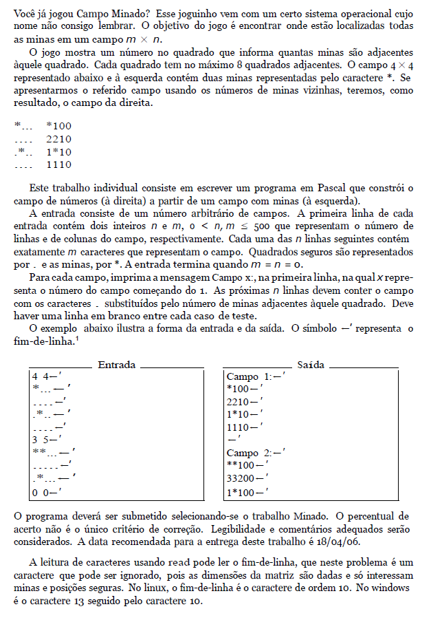

# Campo Minado

Esse é um exercício de programação em C que resolve o seguinte problema:



Referência: [UVA-10189](https://onlinejudge.org/index.php?option=onlinejudge&Itemid=8&page=show_problem&problem=1130)

## Como compilar

Para compilar este programa é necessário executar o seguinte comando:
 ```sh
 gcc main.c -o campoMinado
 ```